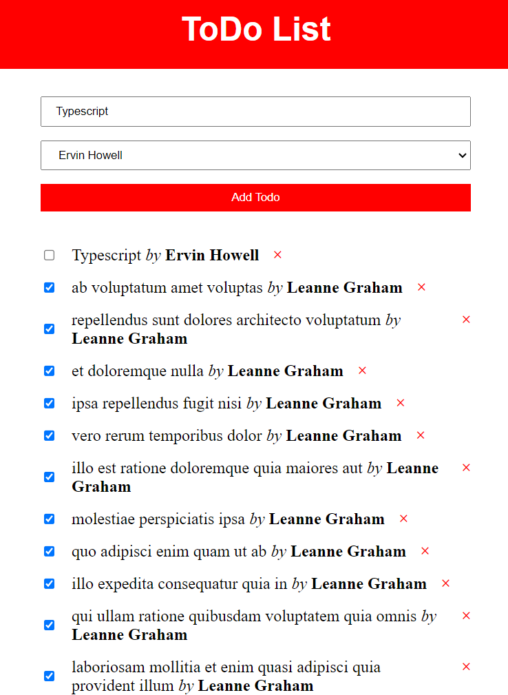
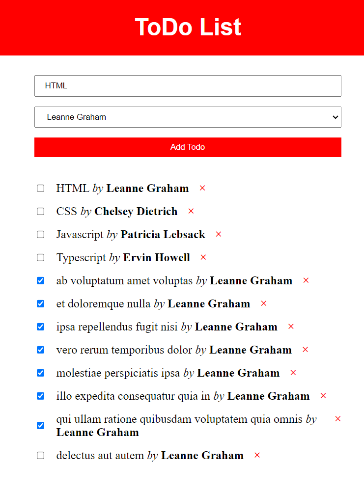

## Todoapp (Vanilla JS → TypeScript)

This project is a simple Todo List application that I initially built using Vanilla JavaScript and later migrated to TypeScript. The main objective was to explore TypeScript's features and understand how it improves code quality and development experience.

## Features

- Add new todos with a title and assign it to a user.
- Mark todos as completed/incomplete.
- Delete existing todos.
- Fetch data from a public API to simulate a real-world backend.#

## Technologies Used

- **TypeScript**: Used for type-safe coding and better code maintainability.
- **Vanilla JavaScript**: For DOM manipulation and event handling.
- **HTML/CSS**: Basic layout and styling.
- **Fetch API**: To retrieve and send data to the placeholder API.

 

 